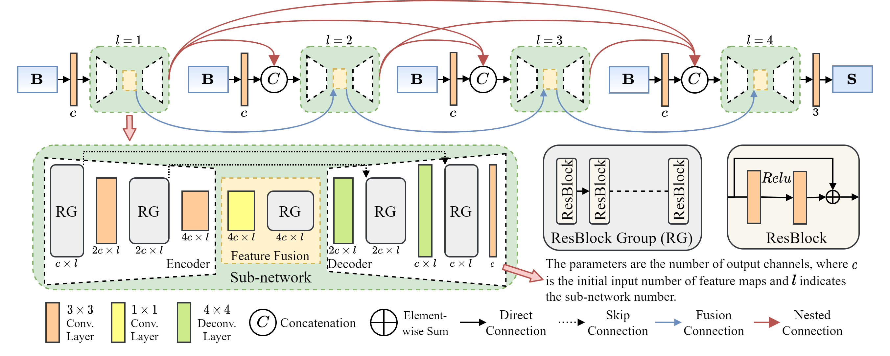
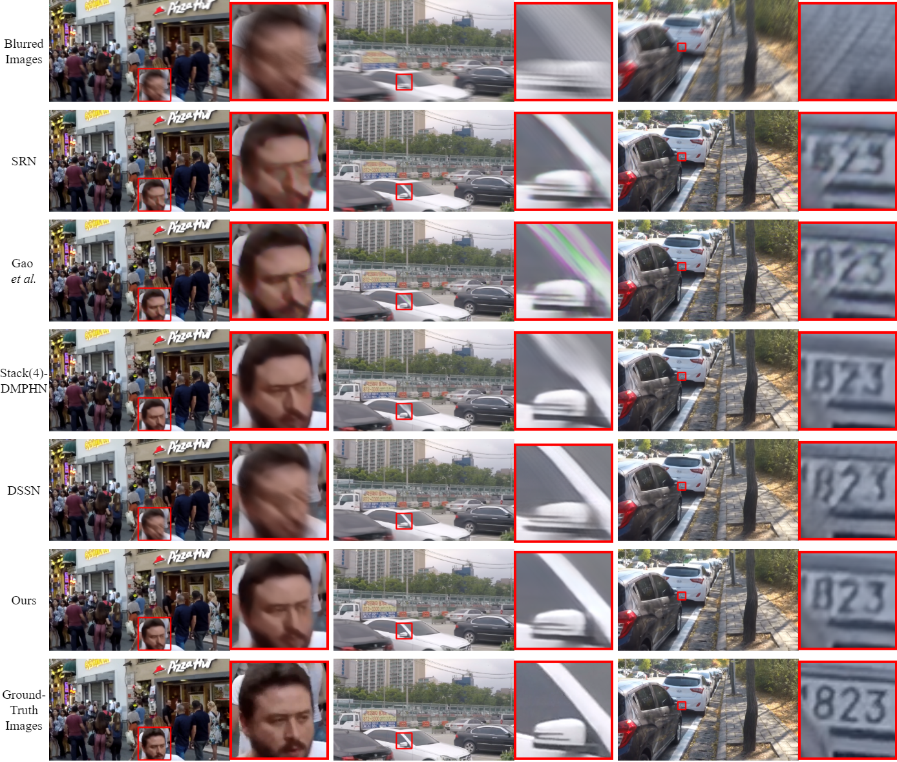
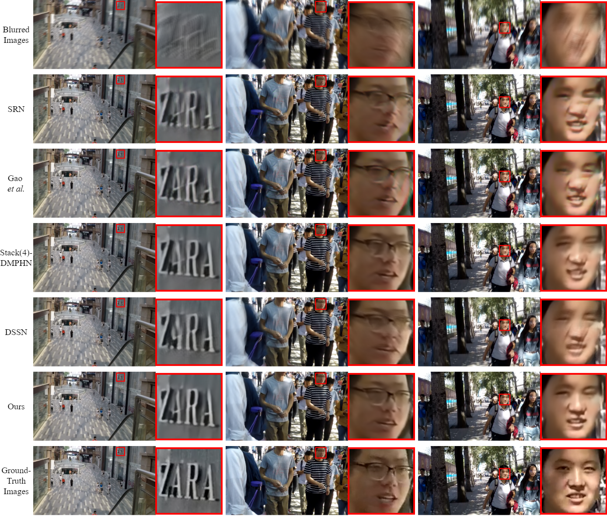

# LNNet: Lightweight Nested Network for motion deblurring
by Cai Guo, Qian Wang, [Hong-Ning Dai](https://www.henrylab.net), Hao Wang, [Ping Li](https://www.comp.polyu.edu.hk/~pinli).

Pytorch Implementation of "LNNet: Lightweight Nested Network for motion deblurring"


### Results on the GoPro evaluation dataset


### Results on the HIDE evaluation dataset


## Dependencies
python
```
conda create -n lnnet python=3.8
conda activate lnnet
```
pytorch
```
conda install pytorch==1.8.0 torchvision==0.9.0 torchaudio==0.8.0 cudatoolkit=11.1 -c pytorch -c conda-forge
```

## Testing
Please copy test samples into './test_samples'. Then running the following command.
```
python test.py
```

## Results
The deblurring results of LNNet on GoPro test set: https://drive.google.com/file/d/1poWZddw4RCMO7vkZ78tL3ZW3vYwAUjOC/view?usp=sharing

## Citation
If you think this work is useful for your research, please cite the following paper.

```
@article{guo2022lnnet,
  title={LNNet: Lightweight Nested Network for motion deblurring},
  author={Guo, Cai and Wang, Qian and Dai, Hong-Ning and Wang, Hao and Li, Ping},
  journal={Journal of Systems Architecture},
  volume = {129},
  pages={102584},
  year={2022},
  publisher={Elsevier},
  doi = {https://doi.org/10.1016/j.sysarc.2022.102584}
}
```
